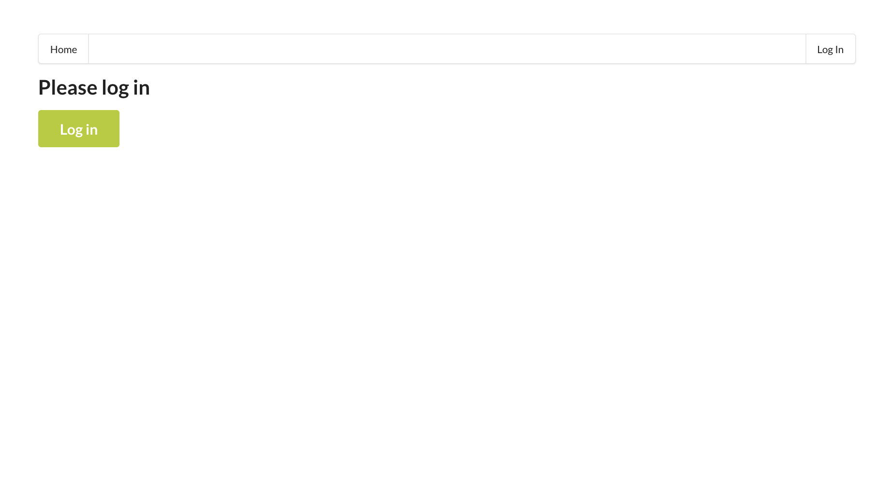
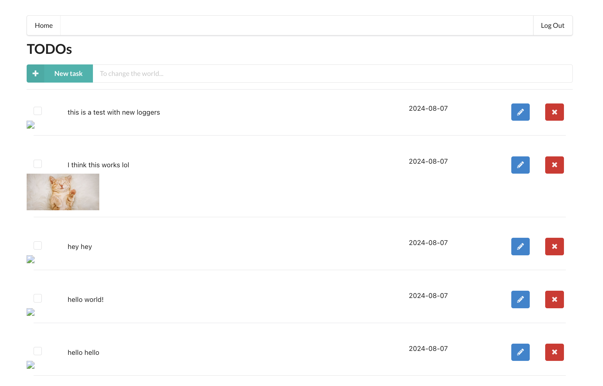
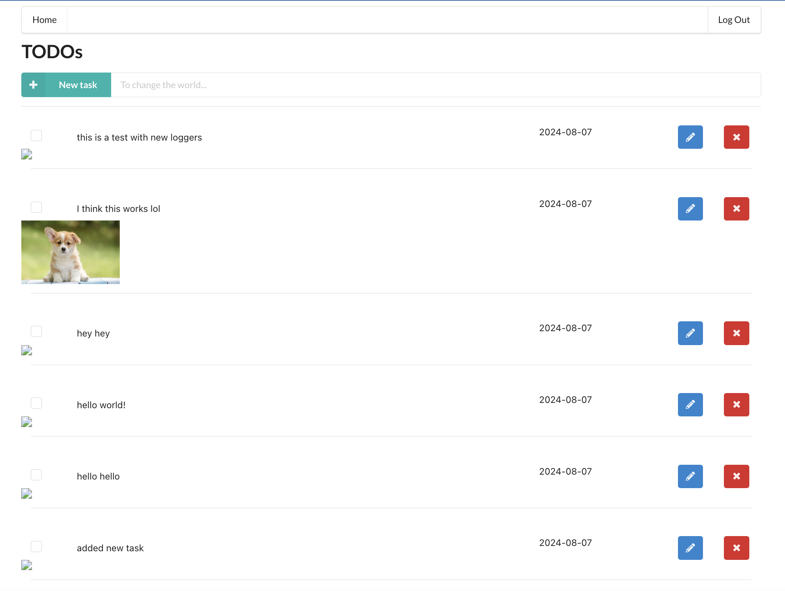
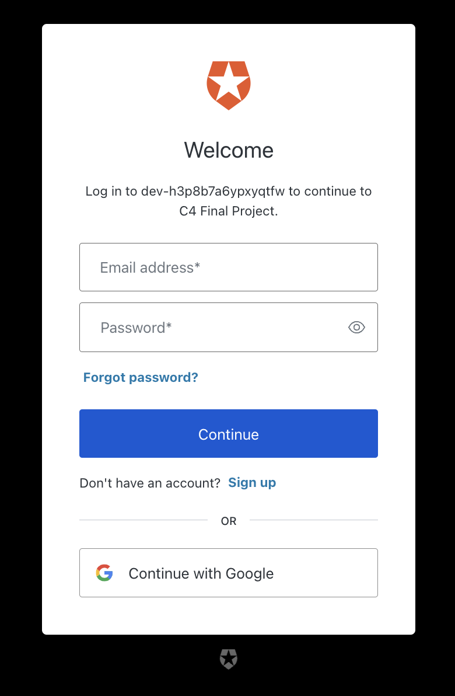
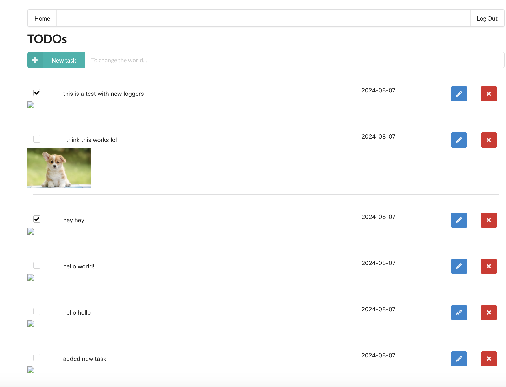
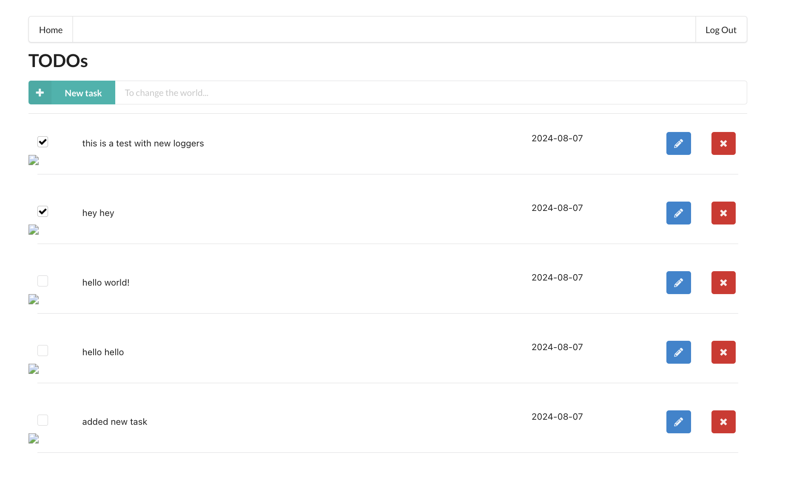
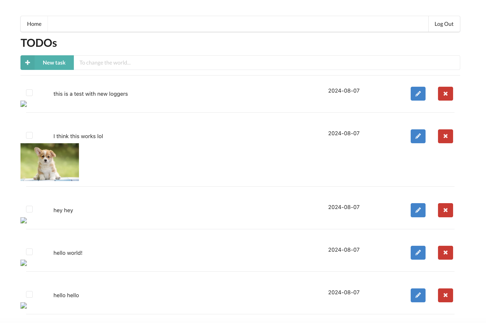

# Develop and Deploy Serverless Apps

## Project Description
In this project, we develop and deploy a simple Task List application using AWS Lambda and Serverless framework. This application will allow users to create/remove/update/get task list items.

## Table of Contents
- [Client](#client)
- [Backend](#backend)
- [Screenshots](#screenshots)

## Client
The `client` folder contains the UI of the app.

## Backend
The `backend` folder contains the backend of the app.

## Screenshots
Here are some screenshots of the application:

### Login Page

### Added image to todo

### Added todo

### Authentication using Auth0

### Checkbox Functionality for completed

### Deleted todo

### Updated image in todo
