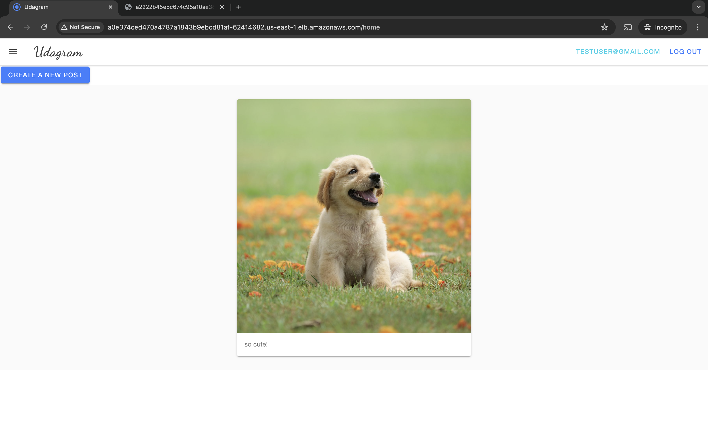

# Monolith to Microservices at Scale

## Overview

This repository contains a comprehensive CI/CD pipeline and deployment setup using Docker, GitHub Actions, and Kubernetes. The project demonstrates the entire workflow from code commit to deployment in a scalable environment.

## Directory Structure

The following folders contain relevant documentation and screenshots related to different aspects of the project:

- **cicd**: CI/CD pipeline configurations and related documentation.

- **docker hub**: Docker images pushed to Docker Hub.

- **feed_api**: Backend API implementation for feed management.

- **feed_item_api**: API for handling individual feed items.

- **feed_logs**: Logs related to feed services.

- **frontend_logs**: Logs related to the frontend application.

- **horizontal_scaling**: Configurations and screenshots related to horizontal scaling setups.

- **kubernetes-services**: Details about the Kubernetes services defined in the project.

- **pods**: Information and logs regarding Kubernetes pods.

- **ui_multi_upload_test**: Tests for multi-upload functionality in the UI.

- **ui_upload_test**: Tests for single upload functionality in the UI.

- **ui_with_login**: Screenshots of the UI with user authentication.

- **ui_without_login**: Screenshots of the UI without user authentication.

- **user_logs_activity**: Logs capturing user activities within the application.

- **user_logs_horizontal_scaling**: Logs related to user activities with horizontal scaling events.

